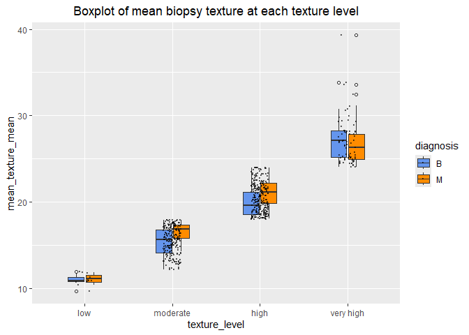

Mini Data-Analysis Deliverable 2
================
Eric Xiang
2024-10-23

*To complete this milestone, you can either edit [this `.rmd`
file](https://raw.githubusercontent.com/UBC-STAT/stat545.stat.ubc.ca/master/content/mini-project/mini-project-2.Rmd)
directly. Fill in the sections that are commented out with
`<!--- start your work here--->`. When you are done, make sure to knit
to an `.md` file by changing the output in the YAML header to
`github_document`, before submitting a tagged release on canvas.*

# Welcome to the rest of your mini data analysis project!

In Milestone 1, you explored your data. and came up with research
questions. This time, we will finish up our mini data analysis and
obtain results for your data by:

- Making summary tables and graphs
- Manipulating special data types in R: factors and/or dates and times.
- Fitting a model object to your data, and extract a result.
- Reading and writing data as separate files.

We will also explore more in depth the concept of *tidy data.*

**NOTE**: The main purpose of the mini data analysis is to integrate
what you learn in class in an analysis. Although each milestone provides
a framework for you to conduct your analysis, it’s possible that you
might find the instructions too rigid for your data set. If this is the
case, you may deviate from the instructions – just make sure you’re
demonstrating a wide range of tools and techniques taught in this class.

# Instructions

**To complete this milestone**, edit [this very `.Rmd`
file](https://raw.githubusercontent.com/UBC-STAT/stat545.stat.ubc.ca/master/content/mini-project/mini-project-2.Rmd)
directly. Fill in the sections that are tagged with
`<!--- start your work here--->`.

**To submit this milestone**, make sure to knit this `.Rmd` file to an
`.md` file by changing the YAML output settings from
`output: html_document` to `output: github_document`. Commit and push
all of your work to your mini-analysis GitHub repository, and tag a
release on GitHub. Then, submit a link to your tagged release on canvas.

**Points**: This milestone is worth 50 points: 45 for your analysis, and
5 for overall reproducibility, cleanliness, and coherence of the Github
submission.

**Research Questions**: In Milestone 1, you chose four research
questions to focus on. Wherever realistic, your work in this milestone
should relate to these research questions whenever we ask for
justification behind your work. In the case that some tasks in this
milestone don’t align well with one of your research questions, feel
free to discuss your results in the context of a different research
question.

# Learning Objectives

By the end of this milestone, you should:

- Understand what *tidy* data is, and how to create it using `tidyr`.
- Generate a reproducible and clear report using R Markdown.
- Manipulating special data types in R: factors and/or dates and times.
- Fitting a model object to your data, and extract a result.
- Reading and writing data as separate files.

# Setup

Begin by loading your data and the tidyverse package below:

``` r
#package installation code, install if needed
#install.packages("here") 
```

``` r
library(datateachr) # import the data I require
library(tidyverse)#tidyverse tool for data manipulation
library(dplyr)#Dplyr for data manipulation 
library(broom)#broom tool for data prediction based on the model 
#library(tidymodels)#tidymodel for cleaning up the data 
library(here)#here for file referencing 
library(ggplot2)#plotting tool 
```

# Task 1: Process and summarize your data

From milestone 1, you should have an idea of the basic structure of your
dataset (e.g. number of rows and columns, class types, etc.). Here, we
will start investigating your data more in-depth using various data
manipulation functions.

### 1.1 (1 point)

First, write out the 4 research questions you defined in milestone 1
were. This will guide your work through milestone 2:

<!-------------------------- Start your work below ---------------------------->

1.  Does the biopsy mean radius correlate with the perimeter mean of the
    biopsy?

2.  Does the biopsy mean radius correlate with the compactness of the
    biopsy?

3.  Does the biopsy mean texture predict the diagnosis results?

4.  Does the biopsy mean compactness predict the diagnosis results?

    <!----------------------------------------------------------------------------->

Here, we will investigate your data using various data manipulation and
graphing functions.

### 1.2 (8 points)

Now, for each of your four research questions, choose one task from
options 1-4 (summarizing), and one other task from 4-8 (graphing). You
should have 2 tasks done for each research question (8 total). Make sure
it makes sense to do them! (e.g. don’t use a numerical variables for a
task that needs a categorical variable.). Comment on why each task helps
(or doesn’t!) answer the corresponding research question.

Ensure that the output of each operation is printed!

Also make sure that you’re using dplyr and ggplot2 rather than base R.
Outside of this project, you may find that you prefer using base R
functions for certain tasks, and that’s just fine! But part of this
project is for you to practice the tools we learned in class, which is
dplyr and ggplot2.

**Summarizing:**

1.  Compute the *range*, *mean*, and *two other summary statistics* of
    **one numerical variable** across the groups of **one categorical
    variable** from your data.
2.  Compute the number of observations for at least one of your
    categorical variables. Do not use the function `table()`!
3.  Create a categorical variable with 3 or more groups from an existing
    numerical variable. You can use this new variable in the other
    tasks! *An example: age in years into “child, teen, adult, senior”.*
4.  Compute the proportion and counts in each category of one
    categorical variable across the groups of another categorical
    variable from your data. Do not use the function `table()`!

**Graphing:**

6.  Create a graph of your choosing, make one of the axes logarithmic,
    and format the axes labels so that they are “pretty” or easier to
    read.
7.  Make a graph where it makes sense to customize the alpha
    transparency.

Using variables and/or tables you made in one of the “Summarizing”
tasks:

8.  Create a graph that has at least two geom layers.
9.  Create 3 histograms, with each histogram having different sized
    bins. Pick the “best” one and explain why it is the best.

Make sure it’s clear what research question you are doing each operation
for!

<!------------------------- Start your work below ----------------------------->

**Research Question1:** Does the biopsy mean radius correlate with the
perimeter mean of the biopsy?

I chose *question 1 from summarizing* part. This is because I want to
get a rough idea how the mean radius change from benign to malignant by
computing range mean, median and standard deviation of the variable

I chose *question 7 from the graphing* to show how mean perimeter of the
sample change with diagnosis. I modified the alpha transparency to 0.8
so that I could see the density distribution of the perimeter mean

**Result observations:** based on the density distribution plot and
summary table, it is likely that the perimeter mean of the biopsy is
correlated with the mean radius of the biopsy. Both variables are higher
in mean with malignant diagnosis relative to the benign diagnosis.

``` r
#summarizing radius_mean 
cancer_sample%>%
  group_by(diagnosis)%>%
  summarize(mean=mean(radius_mean),,median=median(radius_mean),sd=sd(radius_mean), range=diff(range(radius_mean)))
```

    ## # A tibble: 2 × 5
    ##   diagnosis  mean median    sd range
    ##   <chr>     <dbl>  <dbl> <dbl> <dbl>
    ## 1 B          12.1   12.2  1.78  10.9
    ## 2 M          17.5   17.3  3.20  17.2

``` r
#plotting 
ggplot(cancer_sample,aes(x=perimeter_mean, fill=diagnosis))+
  geom_density(alpha=0.8)+
  labs(x="mean_perimeter_mean",title="Density distribution of perimeter mean")+
  theme(plot.title=element_text(hjust=0.5))
```

<!-- -->

**Research Question2:** Does the biopsy mean radius correlate with the
compactness of the biopsy?

I chose *question 1 from the summarizing* part. This is because I want
to get a rough idea how the mean radius change from benign to malignant
by computing range mean, median and standard deviation of the variable

I *chose question 8* from graphing by plotting a dot plot to show the
relationship between mean compactness and mean radius. I used
geom_smooth function to visualize the relationship (regression line
between the two variables). I also plotted the mean radius in malignant
and in the benign groups to assess if the correlation changes with
different diagnoses.

**Result observations:**

From the summary table, I see that mean and median compactness is higher
in the malignant, suggesting mean compactness of the sample also
increases with malignant diagnosis, similar to mean radius’ trend.

From the dot plot, I see that the relationship between mean compactness
and mean radius is unrelated (i.e. horizontal trend line) when mean
radius\<15, but after mean radius \>15, the compactness increases with
the radius linearly. This change might be because of the diagnosis. When
plotting the mean radius of the biopsy in the benign group (12.1,blue
dotted line) and in the malignant group (17.4,red dotted line), we can
observe mean radius and mean compactness of the biopsy are likely more
related in the malignant group than in the benign group.

However, a statistical test is required to confirm the relationship
between the two variables.

``` r
#summarizing compactness mean 
cancer_sample%>%
  group_by(diagnosis)%>%
  summarize(mean=mean(compactness_mean),range=diff(range(compactness_mean)),median=median(compactness_mean),sd=sd(compactness_mean))
```

    ## # A tibble: 2 × 5
    ##   diagnosis   mean range median     sd
    ##   <chr>      <dbl> <dbl>  <dbl>  <dbl>
    ## 1 B         0.0801 0.205 0.0753 0.0337
    ## 2 M         0.145  0.299 0.132  0.0540

``` r
#plotting a dot plot showing the correlation between mean radius and mean compactness 
ggplot(cancer_sample,aes(x=radius_mean,y=compactness_mean ))+
  geom_point()+
  geom_smooth()+
  geom_vline(xintercept=12.1,linetype="dotted",color="cornflowerblue",size=1.5)+#plot mean radius in the benign group
  geom_vline(xintercept=17.4,linetype="dotted",color="red",size=1.5)+ #plot mean radius in the malignant group
  labs(x="radius_mean ",y="compactness_mean",title="Dotplot of mean compactness and mean radius")+
  theme(plot.title = element_text(hjust=0.5)) #create axis labels and titles
```

    ## Warning: Using `size` aesthetic for lines was deprecated in ggplot2 3.4.0.
    ## ℹ Please use `linewidth` instead.
    ## This warning is displayed once every 8 hours.
    ## Call `lifecycle::last_lifecycle_warnings()` to see where this warning was
    ## generated.

    ## `geom_smooth()` using method = 'loess' and formula = 'y ~ x'

<!-- -->

**Research Question 3:** Does the biopsy mean texture predict the
diagnosis results?

I *chose question3* from summarizing. I first analyzed the range,mean,
median, min, max and standard deviation of the texture mean in both
malignant and benign group. Based on the summarized data, I then
determined the cut off for each texture group. I then created a new
categorical variable called texture_level to group the texture_mean into
four levels. This will allow me to predict if the variable change
correlation as the mean texture changes. I printed the table to confirm
that the categorization was successful. I also counted the number of
observation at each level. I then used the ggplot to plot the texture
mean grouped at different level. I found that texture mean have a
positive correlation with diagnosis (i.e. increase with malignant
diagnoses) in the moderate and the high group while the very high or low
group did not show the trend, possibly due to fact that these group have
the highest observations, showing the dominant trend.

I *chose question 8* from graphing part and plotted the mean texture in
malignant and benign group with box plot. I found that the texture
increases with malignant samples compared to the benign biopsies. I also
plotted the mean texture mean in the malignant and in the benign group.
The mean is close to the median, suggesting the distribution is normal.

**Result observation:** Texture mean is correlated with the diagnosis
result and will increase with malignant diagnosis. The correlation is
particularly strong when mean texture is between 12-24

``` r
#summarizing texture mean+categorize into different levels 

cancer_sample%>%
  group_by(diagnosis)%>%
  summarize(mean=mean(texture_mean),min=min(texture_mean),max=max(texture_mean),median=median(texture_mean),sd=sd(texture_mean),range=diff(range(texture_mean)))
```

    ## # A tibble: 2 × 7
    ##   diagnosis  mean   min   max median    sd range
    ##   <chr>     <dbl> <dbl> <dbl>  <dbl> <dbl> <dbl>
    ## 1 B          17.9  9.71  33.8   17.4  4.00  24.1
    ## 2 M          21.6 10.4   39.3   21.5  3.78  28.9

``` r
cancer_modified<-cancer_sample %>% 
   mutate(texture_level = factor(case_when(texture_mean < 12 ~ "low",
                                 texture_mean < 18 ~ "moderate",
                                 texture_mean< 24~"high",
                                 TRUE ~ "very high"),
                      levels = c('low', 'moderate', 'high', 'very high')))
#confirmed texture_level is created and show the counts in each level 
cancer_modified #printing table
```

    ## # A tibble: 569 × 33
    ##          ID diagnosis radius_mean texture_mean perimeter_mean area_mean
    ##       <dbl> <chr>           <dbl>        <dbl>          <dbl>     <dbl>
    ##  1   842302 M                18.0         10.4          123.      1001 
    ##  2   842517 M                20.6         17.8          133.      1326 
    ##  3 84300903 M                19.7         21.2          130       1203 
    ##  4 84348301 M                11.4         20.4           77.6      386.
    ##  5 84358402 M                20.3         14.3          135.      1297 
    ##  6   843786 M                12.4         15.7           82.6      477.
    ##  7   844359 M                18.2         20.0          120.      1040 
    ##  8 84458202 M                13.7         20.8           90.2      578.
    ##  9   844981 M                13           21.8           87.5      520.
    ## 10 84501001 M                12.5         24.0           84.0      476.
    ## # ℹ 559 more rows
    ## # ℹ 27 more variables: smoothness_mean <dbl>, compactness_mean <dbl>,
    ## #   concavity_mean <dbl>, concave_points_mean <dbl>, symmetry_mean <dbl>,
    ## #   fractal_dimension_mean <dbl>, radius_se <dbl>, texture_se <dbl>,
    ## #   perimeter_se <dbl>, area_se <dbl>, smoothness_se <dbl>,
    ## #   compactness_se <dbl>, concavity_se <dbl>, concave_points_se <dbl>,
    ## #   symmetry_se <dbl>, fractal_dimension_se <dbl>, radius_worst <dbl>, …

``` r
cancer_modified%>%
  group_by(texture_level)%>%
  count()
```

    ## # A tibble: 4 × 2
    ## # Groups:   texture_level [4]
    ##   texture_level     n
    ##   <fct>         <int>
    ## 1 low              11
    ## 2 moderate        220
    ## 3 high            262
    ## 4 very high        76

``` r
#plotting the texture_level grouped by the diagnoses
ggplot(cancer_modified,aes(x=texture_level,y=texture_mean,fill=diagnosis ))+
  geom_boxplot(outlier.shape=1,width=0.4)+
  geom_jitter(width=0.1,size=0.15,alpha=0.5)+
  scale_fill_manual(values=c("cornflowerblue","darkorange"))+
  labs(x="texture_level",y="mean_texture_mean",title="Boxplot of mean biopsy texture at each texture level")+
  theme(plot.title = element_text(hjust=0.5)) #create axis labels and titles
```

<!-- -->

``` r
#Graphing question 8 graphing with multiple layers (mean of texture is indicated in the graph as a black dot)
  
ggplot(cancer_sample,aes(x=diagnosis,y=texture_mean,fill=diagnosis ))+
  geom_boxplot(outlier.shape=1,width=0.4)+
  stat_summary(fun="mean",color="black",shape=15)+
  scale_fill_manual(values=c("cornflowerblue","darkorange"))+
  labs(x="diagnosis",y="mean_texture_mean",title="Boxplot of mean biopsy texture")+
  theme(plot.title = element_text(hjust=0.5)) #create axis labels and titles
```

    ## Warning: Removed 2 rows containing missing values or values outside the scale range
    ## (`geom_segment()`).

<!-- -->

``` r
#mean is similar to the median-> likely the distribution is normal 
```

**Research Question 4:** Does the biopsy mean compactness predict the
diagnosis results?

I *chose question3* from summarizing. I first analyzed the range,mean,
median, min, max, and standard deviation of the mean compactness in both
malignant and benign group. Based on the summarized data, I then
determined the cut off for each group. I then created a new categorical
variable called compactness_level to group the compactness \_mean into
four levels. This will allow me to predict if the variable changes
correlation as the mean compactness changes. I printed the table to
confirm that the categorization was successful. I also counted the
number of observation at each level. I then used the ggplot to plot the
compactness mean grouped at different level. I found that compactness
mean have a positive correlation with diagnosis (i.e. increase with
malignant diagnoses) at all levels.

I *chose question 8* from graphing part and plotted the mean compactness
with box plot. I found that the compactness increases with malignant
samples compared to the benign biopsies. I also plotted the mean of the
compactness mean in the malignant and in the benign group. The mean is
close to the median, suggesting the distribution is normal.

**Result observation:** Texture mean is correlated with the diagnosis
result and will increase with malignant diagnosis. The correlation is
particularly strong when mean texture is between 12-24

``` r
#summarizing and categorizing compactness into different levels
cancer_sample%>%
  group_by(diagnosis)%>%
  summarize(mean=mean(compactness_mean),min=min(compactness_mean),max=max(texture_mean),median=median(compactness_mean),sd=sd(compactness_mean),range=diff(range(compactness_mean)))
```

    ## # A tibble: 2 × 7
    ##   diagnosis   mean    min   max median     sd range
    ##   <chr>      <dbl>  <dbl> <dbl>  <dbl>  <dbl> <dbl>
    ## 1 B         0.0801 0.0194  33.8 0.0753 0.0337 0.205
    ## 2 M         0.145  0.0460  39.3 0.132  0.0540 0.299

``` r
cancer_modified<-cancer_modified%>% 
   mutate(compact_level = factor(case_when(compactness_mean < 0.065 ~ "low",
                                 compactness_mean < 0.11 ~ "moderate",
                                 compactness_mean< 0.14~"high",
                                 TRUE ~ "very high"),
                      levels = c('low', 'moderate', 'high', 'very high')))
#print the modified table to confirm categorization and counts in each level 
cancer_modified%>%
  group_by(compact_level)%>%
  count()
```

    ## # A tibble: 4 × 2
    ## # Groups:   compact_level [4]
    ##   compact_level     n
    ##   <fct>         <int>
    ## 1 low             143
    ## 2 moderate        204
    ## 3 high            106
    ## 4 very high       116

``` r
#plotting compactness_mean in four levels 
ggplot(cancer_modified,aes(x=compact_level,y=compactness_mean,fill=diagnosis ))+
  geom_boxplot(outlier.shape=1,width=0.4)+
  geom_jitter(width=0.1,size=0.15,alpha=0.3)+
  scale_x_discrete(drop = FALSE)+
  scale_fill_manual(values=c("cornflowerblue","darkorange"))+
  labs(x="compact_level",y="mean_compactness_mean",title="Boxplot of mean biopsy compactness at each compact level")+
  theme(plot.title = element_text(hjust=0.5)) #create axis labels and titles
```

<!-- -->

``` r
#Graphing question 8 graphing with multiple layers (mean compactness_mean is plotted as black dots. ) 

ggplot(cancer_modified,aes(x=diagnosis,y=compactness_mean,fill=diagnosis ))+
  geom_boxplot(outlier.shape=1,width=0.4)+
  stat_summary(fun="mean",color="black",shape=15)+  scale_fill_manual(values=c("cornflowerblue","darkorange"))+
  labs(x="diagnosis",y="mean_compactness_mean",title="Boxplot of  biopsy compactness_mean")+
  theme(plot.title = element_text(hjust=0.5)) #create axis labels and titles
```

    ## Warning: Removed 2 rows containing missing values or values outside the scale range
    ## (`geom_segment()`).

<!-- -->

<!----------------------------------------------------------------------------->

### 1.3 (2 points)

Based on the operations that you’ve completed, how much closer are you
to answering your research questions? Think about what aspects of your
research questions remain unclear. Can your research questions be
refined, now that you’ve investigated your data a bit more? Which
research questions are yielding interesting results?

<!------------------------- Write your answer here ---------------------------->

Based on the qualitative exploration of the data points, it is clear
that biopsy radius increase with perimeter mean so they are correlated.

Radius mean maybe correlated with compactness but not clear unless doing
statistical tests. I would do a model testing to assess the significance
based on the p value.

The box plot showed that the biopsy texture and compactness vary from
benign to malignant diagnosis, suggesting the two variables can predict
cancer diagnosis. A statistical test like a T test would help
quantitatively confirm the plot observations.

<!----------------------------------------------------------------------------->

# Task 2: Tidy your data

In this task, we will do several exercises to reshape our data. The goal
here is to understand how to do this reshaping with the `tidyr` package.

A reminder of the definition of *tidy* data:

- Each row is an **observation**
- Each column is a **variable**
- Each cell is a **value**

### 2.1 (2 points)

Based on the definition above, can you identify if your data is tidy or
untidy? Go through all your columns, or if you have \>8 variables, just
pick 8, and explain whether the data is untidy or tidy.

<!--------------------------- Start your work below --------------------------->

I will choose the cancer_modified data set containing new variables
**texture_level and compactness_level** for the tidy analysis.

Based on my proposed research questions, I chose ID, diagnosis,
radius_mean, texture_mean, perimeter_mean, compactness_mean,
texture_level and compactness_level for my analysis on whether the data
set is tidy

Based on my observation, the selected cancer_sample table is tidy

As indicated in the sample sanpshot below, each row has a unique ID,
indicating a unique observation. Each column is a unique variable of
measurement, from the variable mean and level For each cell, the value
is also unique.

The format of the table also makes it easy for me to answer my
questions. I just to need to select the columns based on the variables I
am interested in (e.g. diagnosis, radius_mean, texture_mean and
compactness_mean) and drop other irrelevant columns when addressing my
questions.

``` r
cancer_modified%>%
  select(ID, diagnosis, radius_mean, texture_mean, perimeter_mean,compactness_mean,texture_level,compactness_mean)
```

    ## # A tibble: 569 × 7
    ##          ID diagnosis radius_mean texture_mean perimeter_mean compactness_mean
    ##       <dbl> <chr>           <dbl>        <dbl>          <dbl>            <dbl>
    ##  1   842302 M                18.0         10.4          123.            0.278 
    ##  2   842517 M                20.6         17.8          133.            0.0786
    ##  3 84300903 M                19.7         21.2          130             0.160 
    ##  4 84348301 M                11.4         20.4           77.6           0.284 
    ##  5 84358402 M                20.3         14.3          135.            0.133 
    ##  6   843786 M                12.4         15.7           82.6           0.17  
    ##  7   844359 M                18.2         20.0          120.            0.109 
    ##  8 84458202 M                13.7         20.8           90.2           0.164 
    ##  9   844981 M                13           21.8           87.5           0.193 
    ## 10 84501001 M                12.5         24.0           84.0           0.240 
    ## # ℹ 559 more rows
    ## # ℹ 1 more variable: texture_level <fct>

<!----------------------------------------------------------------------------->

### 2.2 (4 points)

Now, if your data is tidy, untidy it! Then, tidy it back to it’s
original state.

If your data is untidy, then tidy it! Then, untidy it back to it’s
original state.

Be sure to explain your reasoning for this task. Show us the “before”
and “after”.

<!--------------------------- Start your work below --------------------------->

As explained in task 1, the original data table is tidy to answer my
four research questions (**cancer_modified**, including the
texture_level variable I categorized myself). To make the table untidy,
I first selected the 8 variables I am interested in for the downstream
analysis. I then make the table wider by moving texture_level
information into new columns. This is an untidy dataset because the ID
is now moving to become the column name with texture level becoming its
value. For each ID column, there is only one value, the rest are just
empty cells.

``` r
#untidy the data 
cancer_untidy<-cancer_modified%>%
  select(ID, diagnosis, radius_mean,compact_level,texture_level)%>%
  pivot_wider(names_from=ID,
              values_from=texture_level)

#print out tidy and untidy dataset 
cancer_modified  
```

    ## # A tibble: 569 × 34
    ##          ID diagnosis radius_mean texture_mean perimeter_mean area_mean
    ##       <dbl> <chr>           <dbl>        <dbl>          <dbl>     <dbl>
    ##  1   842302 M                18.0         10.4          123.      1001 
    ##  2   842517 M                20.6         17.8          133.      1326 
    ##  3 84300903 M                19.7         21.2          130       1203 
    ##  4 84348301 M                11.4         20.4           77.6      386.
    ##  5 84358402 M                20.3         14.3          135.      1297 
    ##  6   843786 M                12.4         15.7           82.6      477.
    ##  7   844359 M                18.2         20.0          120.      1040 
    ##  8 84458202 M                13.7         20.8           90.2      578.
    ##  9   844981 M                13           21.8           87.5      520.
    ## 10 84501001 M                12.5         24.0           84.0      476.
    ## # ℹ 559 more rows
    ## # ℹ 28 more variables: smoothness_mean <dbl>, compactness_mean <dbl>,
    ## #   concavity_mean <dbl>, concave_points_mean <dbl>, symmetry_mean <dbl>,
    ## #   fractal_dimension_mean <dbl>, radius_se <dbl>, texture_se <dbl>,
    ## #   perimeter_se <dbl>, area_se <dbl>, smoothness_se <dbl>,
    ## #   compactness_se <dbl>, concavity_se <dbl>, concave_points_se <dbl>,
    ## #   symmetry_se <dbl>, fractal_dimension_se <dbl>, radius_worst <dbl>, …

``` r
cancer_untidy
```

    ## # A tibble: 535 × 572
    ##    diagnosis radius_mean compact_level `842302` `842517` `84300903` `84348301`
    ##    <chr>           <dbl> <fct>         <fct>    <fct>    <fct>      <fct>     
    ##  1 M                18.0 very high     low      <NA>     <NA>       <NA>      
    ##  2 M                20.6 moderate      <NA>     moderate <NA>       <NA>      
    ##  3 M                19.7 very high     <NA>     <NA>     high       <NA>      
    ##  4 M                11.4 very high     <NA>     <NA>     <NA>       high      
    ##  5 M                20.3 high          <NA>     <NA>     <NA>       <NA>      
    ##  6 M                12.4 very high     <NA>     <NA>     <NA>       <NA>      
    ##  7 M                18.2 moderate      <NA>     <NA>     <NA>       <NA>      
    ##  8 M                13.7 very high     <NA>     <NA>     <NA>       <NA>      
    ##  9 M                13   very high     <NA>     <NA>     <NA>       <NA>      
    ## 10 M                12.5 very high     <NA>     <NA>     <NA>       <NA>      
    ## # ℹ 525 more rows
    ## # ℹ 565 more variables: `84358402` <fct>, `843786` <fct>, `844359` <fct>,
    ## #   `84458202` <fct>, `844981` <fct>, `84501001` <fct>, `845636` <fct>,
    ## #   `84610002` <fct>, `846226` <fct>, `846381` <fct>, `84667401` <fct>,
    ## #   `84799002` <fct>, `848406` <fct>, `84862001` <fct>, `849014` <fct>,
    ## #   `8510426` <fct>, `8510653` <fct>, `8510824` <fct>, `8511133` <fct>,
    ## #   `851509` <fct>, `852552` <fct>, `852631` <fct>, `852763` <fct>, …

``` r
#Tidy it back to the original state
cancer_untidy%>%
    pivot_longer(col=!(diagnosis:compact_level),
      names_to="ID",
      values_to="texture_level",
      values_drop_na = TRUE)%>%
  relocate(ID,everything())
```

    ## # A tibble: 569 × 5
    ##    ID       diagnosis radius_mean compact_level texture_level
    ##    <chr>    <chr>           <dbl> <fct>         <fct>        
    ##  1 842302   M                18.0 very high     low          
    ##  2 842517   M                20.6 moderate      moderate     
    ##  3 84300903 M                19.7 very high     high         
    ##  4 84348301 M                11.4 very high     high         
    ##  5 84358402 M                20.3 high          moderate     
    ##  6 843786   M                12.4 very high     moderate     
    ##  7 844359   M                18.2 moderate      high         
    ##  8 84458202 M                13.7 very high     high         
    ##  9 844981   M                13   very high     high         
    ## 10 84501001 M                12.5 very high     very high    
    ## # ℹ 559 more rows

<!----------------------------------------------------------------------------->

### 2.3 (4 points)

Now, you should be more familiar with your data, and also have made
progress in answering your research questions. Based on your interest,
and your analyses, pick 2 of the 4 research questions to continue your
analysis in the remaining tasks:

<!-------------------------- Start your work below ---------------------------->

1.  Does the biopsy mean compactness predict the diagnosis results?
2.  Does the biopsy mean radius correlate with the compactness of the
    biopsy?

<!----------------------------------------------------------------------------->

Explain your decision for choosing the above two research questions.

<!--------------------------- Start your work below --------------------------->

**To address my first question,** previously, I plotted a box plot to
show that the mean compactness increases from benign to malignant
diagnoses. I want to perform statistical tests to confirm if the biopsy
compactness mean is statistically different between the malignant and
benign diagnoses.

**To address my second research question,** I previously plotted a dot
plot showing mean compactness and radius are linearly correlated by eye
if radius is mean is larger than 15. To confirm the correlation between
the two variables, I will establish a linear regression model between
compactness mean and radius mean and then examine the correlation based
on the pvalue for radius_mean in the statistic summary.

<!----------------------------------------------------------------------------->

Now, try to choose a version of your data that you think will be
appropriate to answer these 2 questions. Use between 4 and 8 functions
that we’ve covered so far (i.e. by filtering, cleaning, tidy’ing,
dropping irrelevant columns, etc.).

(If it makes more sense, then you can make/pick two versions of your
data, one for each research question.)

<!--------------------------- Start your work below --------------------------->

To answer my first question, I will select mean_compactness and
diagnosis from the cancer_modified table

I also added a new variable compactness_mean group by malignant or
benign so I can compare if individual diagnosis is higher or lower than
the mean of the group.

``` r
changed_cancer1<-cancer_modified%>%
  select(diagnosis,compactness_mean,)%>%
  group_by(diagnosis)%>%
  mutate(mean_compact=mean(compactness_mean))

#print changed_cancer1
changed_cancer1
```

    ## # A tibble: 569 × 3
    ## # Groups:   diagnosis [2]
    ##    diagnosis compactness_mean mean_compact
    ##    <chr>                <dbl>        <dbl>
    ##  1 M                   0.278         0.145
    ##  2 M                   0.0786        0.145
    ##  3 M                   0.160         0.145
    ##  4 M                   0.284         0.145
    ##  5 M                   0.133         0.145
    ##  6 M                   0.17          0.145
    ##  7 M                   0.109         0.145
    ##  8 M                   0.164         0.145
    ##  9 M                   0.193         0.145
    ## 10 M                   0.240         0.145
    ## # ℹ 559 more rows

To answer my second question, I will select compactness_mean,radius_mean
from the cancer_modified table. I will drop any NA data in the data set.
The variable name “compactness_mean” and “radius_mean” are qiute long,
For convenience, I will shorten them to “compactnessM” and “radiusM”
respectively. I also calculated the mean of compactness (mean_compact\_
and radius (mean_radius) for comparison between each observation and the
mean.

``` r
changed_cancer2<-cancer_sample%>%
  select(diagnosis,compactness_mean,radius_mean)%>%
  drop_na(compactness_mean,radius_mean)%>%
  rename(compactnessM=compactness_mean, radiusM=radius_mean)%>%
  mutate(mean_compact=mean(compactnessM),mean_radius=mean(radiusM))
#print out the data table. 
changed_cancer2
```

    ## # A tibble: 569 × 5
    ##    diagnosis compactnessM radiusM mean_compact mean_radius
    ##    <chr>            <dbl>   <dbl>        <dbl>       <dbl>
    ##  1 M               0.278     18.0        0.104        14.1
    ##  2 M               0.0786    20.6        0.104        14.1
    ##  3 M               0.160     19.7        0.104        14.1
    ##  4 M               0.284     11.4        0.104        14.1
    ##  5 M               0.133     20.3        0.104        14.1
    ##  6 M               0.17      12.4        0.104        14.1
    ##  7 M               0.109     18.2        0.104        14.1
    ##  8 M               0.164     13.7        0.104        14.1
    ##  9 M               0.193     13          0.104        14.1
    ## 10 M               0.240     12.5        0.104        14.1
    ## # ℹ 559 more rows

# Task 3: Modelling

## 3.0 (no points)

Pick a research question from 1.2, and pick a variable of interest
(we’ll call it “Y”) that’s relevant to the research question. Indicate
these.

<!-------------------------- Start your work below ---------------------------->

**Research Question**: Does the biopsy mean radius correlate with the
compactness of the biopsy?

**Variable of interest**: radius_mean

<!----------------------------------------------------------------------------->

## 3.1 (3 points)

Fit a model or run a hypothesis test that provides insight on this
variable with respect to the research question. Store the model object
as a variable, and print its output to screen. We’ll omit having to
justify your choice, because we don’t expect you to know about model
specifics in STAT 545.

- **Note**: It’s OK if you don’t know how these models/tests work. Here
  are some examples of things you can do here, but the sky’s the limit.

  - You could fit a model that makes predictions on Y using another
    variable, by using the `lm()` function.
  - You could test whether the mean of Y equals 0 using `t.test()`, or
    maybe the mean across two groups are different using `t.test()`, or
    maybe the mean across multiple groups are different using `anova()`
    (you may have to pivot your data for the latter two).
  - You could use `lm()` to test for significance of regression
    coefficients.

<!-------------------------- Start your work below ---------------------------->

Based on the dot plot I made in the task1.2, I hypothesize that the mean
radius is correlated with the mean compactness.To test the hypothesis, I
will fit compactness_mean and radius_mean in a linear model and see if
the correlation is significant

From the output table, we see that when x=0 ,y intercept is at 10.60,
slope is 33.77, so the correlation is positive . The correlation is also
significant with p value equal to 2.41e-38, which is way less than 0.05.

``` r
#linear model analysis 
corr_radius<-lm(radius_mean~compactness_mean,data=cancer_sample) 
corr_radius
```

    ## 
    ## Call:
    ## lm(formula = radius_mean ~ compactness_mean, data = cancer_sample)
    ## 
    ## Coefficients:
    ##      (Intercept)  compactness_mean  
    ##            10.60             33.77

``` r
#put the analysis in a table 

tidy(corr_radius)
```

    ## # A tibble: 2 × 5
    ##   term             estimate std.error statistic   p.value
    ##   <chr>               <dbl>     <dbl>     <dbl>     <dbl>
    ## 1 (Intercept)          10.6     0.283      37.5 8.91e-156
    ## 2 compactness_mean     33.8     2.42       14.0 2.41e- 38

<!----------------------------------------------------------------------------->

## 3.2 (3 points)

Produce something relevant from your fitted model: either predictions on
Y, or a single value like a regression coefficient or a p-value.

- Be sure to indicate in writing what you chose to produce.
- Your code should either output a tibble (in which case you should
  indicate the column that contains the thing you’re looking for), or
  the thing you’re looking for itself.
- Obtain your results using the `broom` package if possible. If your
  model is not compatible with the broom function you’re needing, then
  you can obtain your results by some other means, but first indicate
  which broom function is not compatible.

<!-------------------------- Start your work below ---------------------------->

Using the linear correlation model, I predicted the mean_radius when
compactness_mean is 0.1,0.2 and 0.3.

I used the broom package augment function to product a table output
containing mean compactness as the x variable and radius a the y
variable.

``` r
#predict radius_mean using mean compactness with broom::augument function
augment(corr_radius,newdata=tibble(compactness_mean=seq(0.1,0.3,0.1)))
```

    ## # A tibble: 3 × 2
    ##   compactness_mean .fitted
    ##              <dbl>   <dbl>
    ## 1              0.1    14.0
    ## 2              0.2    17.4
    ## 3              0.3    20.7

<!----------------------------------------------------------------------------->

# Task 4: Reading and writing data

Get set up for this exercise by making a folder called `output` in the
top level of your project folder / repository. You’ll be saving things
there.

## 4.1 (3 points)

Take a summary table that you made from Task 1, and write it as a csv
file in your `output` folder. Use the `here::here()` function.

- **Robustness criteria**: You should be able to move your Mini Project
  repository / project folder to some other location on your computer,
  or move this very Rmd file to another location within your project
  repository / folder, and your code should still work.
- **Reproducibility criteria**: You should be able to delete the csv
  file, and remake it simply by knitting this Rmd file.

<!-------------------------- Start your work below ---------------------------->

``` r
#Generating the summary table 
radius_summary<-cancer_sample%>%
  group_by(diagnosis)%>%
  summarize(mean=mean(radius_mean),min=min(radius_mean),max=max(radius_mean),median=median(radius_mean),sd=sd(radius_mean), range=diff(range(radius_mean)))

#create the file "output" if not existing 
if (!file.exists(here("output"))){
    dir.create(here("output"))
}


#Save the summary table as the CSV file 
write.csv(radius_summary, here("output","radius_summmary.csv"))
```

<!----------------------------------------------------------------------------->

## 4.2 (3 points)

Write your model object from Task 3 to an R binary file (an RDS), and
load it again. Be sure to save the binary file in your `output` folder.
Use the functions `saveRDS()` and `readRDS()`.

- The same robustness and reproducibility criteria as in 4.1 apply here.

<!-------------------------- Start your work below ---------------------------->

``` r
#Generating the linear model again  

corr_radius<-lm(radius_mean~compactness_mean,data=cancer_sample) 
#create an output folder if not already
if (!file.exists(here("output"))){
    dir.create(here("output"))
}
#save the model as the RDS file 
saveRDS(corr_radius,here("output","corr_radius.RDS"))
```

<!----------------------------------------------------------------------------->

# Overall Reproducibility/Cleanliness/Coherence Checklist

Here are the criteria we’re looking for.

## Coherence (0.5 points)

The document should read sensibly from top to bottom, with no major
continuity errors.

The README file should still satisfy the criteria from the last
milestone, i.e. it has been updated to match the changes to the
repository made in this milestone.

## File and folder structure (1 points)

You should have at least three folders in the top level of your
repository: one for each milestone, and one output folder. If there are
any other folders, these are explained in the main README.

Each milestone document is contained in its respective folder, and
nowhere else.

Every level-1 folder (that is, the ones stored in the top level, like
“Milestone1” and “output”) has a `README` file, explaining in a sentence
or two what is in the folder, in plain language (it’s enough to say
something like “This folder contains the source for Milestone 1”).

## Output (1 point)

All output is recent and relevant:

- All Rmd files have been `knit`ted to their output md files.
- All knitted md files are viewable without errors on Github. Examples
  of errors: Missing plots, “Sorry about that, but we can’t show files
  that are this big right now” messages, error messages from broken R
  code
- All of these output files are up-to-date – that is, they haven’t
  fallen behind after the source (Rmd) files have been updated.
- There should be no relic output files. For example, if you were
  knitting an Rmd to html, but then changed the output to be only a
  markdown file, then the html file is a relic and should be deleted.

Our recommendation: delete all output files, and re-knit each
milestone’s Rmd file, so that everything is up to date and relevant.

## Tagged release (0.5 point)

You’ve tagged a release for Milestone 2.

### Attribution

Thanks to Victor Yuan for mostly putting this together.
